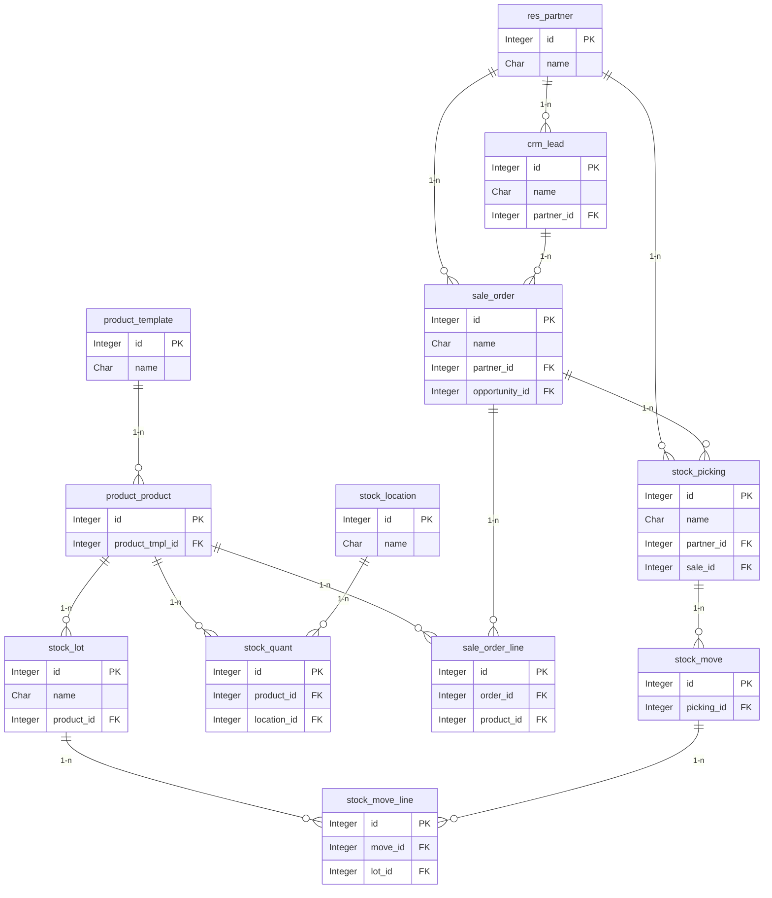
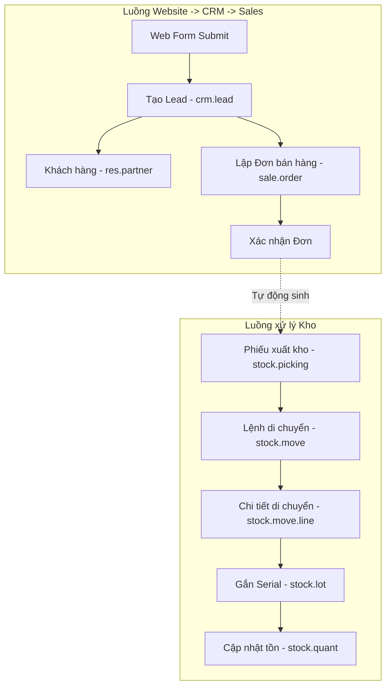

# Tài liệu thiết kế dữ liệu (ERD)

## 1. Sơ đồ thực thể kết hợp (Entity-Relationship Diagram)

Sơ đồ ERD thể hiện mối liên kết giữa các bảng chính trong các phân hệ Inventory, CRM và Sales.

## 2. Chi tiết các bảng dữ liệu

### 2.1 Bảng `product.template` (Template sản phẩm)
**Mô tả:** Chứa thông tin chung của sản phẩm (ví dụ: mẫu Laptop Dell).
| Field       | Kiểu     | Mô tả                                   |
| ----------- | -------- | --------------------------------------- |
| id          | Integer  | Khóa chính                              |
| name        | Char     | Tên sản phẩm                            |
| list_price  | Float    | Giá bán mặc định                        |

### 2.2 Bảng `product.product` (Sản phẩm / Variant)
**Mô tả:** Chứa thông tin biến thể cụ thể của sản phẩm.
| Field           | Kiểu     | Mô tả                                   |
| --------------- | -------- | --------------------------------------- |
| id              | Integer  | Khóa chính                              |
| product_tmpl_id | Many2one | Liên kết đến `product.template`         |

### 2.3 Bảng `stock.lot` (Serial Number)
**Mô tả:** Lưu thông tin từng Serial Number/Lot của sản phẩm.
| Field       | Kiểu     | Mô tả                                   |
| ----------- | -------- | --------------------------------------- |
| id          | Integer  | Khóa chính                              |
| name        | Char     | Mã Serial Number (VD: DELL-INS15-001)   |
| product_id  | Many2one | Liên kết đến sản phẩm (`product.product`)|
| company_id  | Many2one | Công ty sở hữu                          |
| create_date | Datetime | Ngày tạo serial                         |

### 2.4 Bảng `stock.quant` (Tồn kho thực tế)
**Mô tả:** Lưu số lượng tồn kho của một sản phẩm/serial cụ thể tại một vị trí cụ thể.
| Field       | Kiểu     | Mô tả                                   |
| ----------- | -------- | --------------------------------------- |
| id          | Integer  | Khóa chính                              |
| product_id  | Many2one | Sản phẩm                                |
| location_id | Many2one | Vị trí lưu kho (`stock.location`)       |
| lot_id      | Many2one | Số Serial (`stock.lot`)                 |
| quantity    | Float    | Số lượng tồn                            |

### 2.5 Bảng `stock.picking` (Phiếu kho)
**Mô tả:** Phiếu đại diện cho 1 đợt Nhập / Xuất / Chuyển kho.
| Field         | Kiểu     | Mô tả                                   |
| ------------- | -------- | --------------------------------------- |
| id            | Integer  | Khóa chính                              |
| name          | Char     | Số phiếu (WH/OUT/0001)                  |
| picking_type_id | Many2one | Loại phiếu (Nhập, Xuất, Nội bộ)       |
| partner_id    | Many2one | Khách hàng/Nhà cung cấp                 |
| sale_id       | Many2one | Nguồn gốc từ Đơn bán hàng (nếu có)      |

### 2.6 Bảng `stock.move` (Lệnh di chuyển)
**Mô tả:** Mỗi dòng sản phẩm cần di chuyển trong phiếu kho.
| Field       | Kiểu     | Mô tả                                   |
| ----------- | -------- | --------------------------------------- |
| id          | Integer  | Khóa chính                              |
| picking_id  | Many2one | Liên kết đến phiếu kho                  |
| product_id  | Many2one | Sản phẩm cần chuyển                     |

### 2.7 Bảng `stock.move.line` (Chi tiết di chuyển)
**Mô tả:** Di chuyển chi tiết từng món hàng (áp dụng cho việc chọn Serial Number).
| Field       | Kiểu     | Mô tả                                   |
| ----------- | -------- | --------------------------------------- |
| id          | Integer  | Khóa chính                              |
| move_id     | Many2one | Liên kết đến `stock.move`               |
| lot_id      | Many2one | Serial Number được chọn                 |
| qty_done    | Float    | Số lượng thực tế đã hoàn thành          |

### 2.8 Bảng `stock.location` (Vị trí kho)
**Mô tả:** Vị trí vật lý hoặc ảo trong kho (Kệ A, Kệ B, Partner Location).
| Field       | Kiểu     | Mô tả                                   |
| ----------- | -------- | --------------------------------------- |
| id          | Integer  | Khóa chính                              |
| name        | Char     | Tên vị trí                              |

### 2.9 Bảng `res.partner` (Đối tác)
**Mô tả:** Khách hàng hoặc Nhà cung cấp.
| Field       | Kiểu     | Mô tả                                   |
| ----------- | -------- | --------------------------------------- |
| id          | Integer  | Khóa chính                              |
| name        | Char     | Tên đối tác                             |
| email       | Char     | Email liên hệ                           |

### 2.10 Bảng `crm.lead` (Cơ hội kinh doanh)
**Mô tả:** Lead/Opportunity trong pipeline CRM.
| Field       | Kiểu     | Mô tả                                   |
| ----------- | -------- | --------------------------------------- |
| id          | Integer  | Khóa chính                              |
| name        | Char     | Tên cơ hội                              |
| partner_id  | Many2one | Khách hàng (`res.partner`)              |
| stage_id    | Many2one | Trạng thái (New, Qualified, Won...)     |

### 2.11 Bảng `sale.order` (Đơn bán hàng)
**Mô tả:** Đơn bán hàng được chốt từ cơ hội kinh doanh.
| Field          | Kiểu     | Mô tả                                   |
| -------------- | -------- | --------------------------------------- |
| id             | Integer  | Khóa chính                              |
| name           | Char     | Mã đơn hàng (VD: S0001)                 |
| partner_id     | Many2one | Khách hàng (`res.partner`)              |
| opportunity_id | Many2one | Liên kết về CRM (`crm.lead`)            |
| state          | Char     | Trạng thái (Draft, Sale, Done)          |

### 2.12 Bảng `sale.order.line` (Chi tiết Đơn hàng)
**Mô tả:** Chi tiết các sản phẩm được bán trong đơn hàng.
| Field       | Kiểu     | Mô tả                                   |
| ----------- | -------- | --------------------------------------- |
| id          | Integer  | Khóa chính                              |
| order_id    | Many2one | Liên kết đến đơn hàng (`sale.order`)    |
| product_id  | Many2one | Sản phẩm được bán (`product.product`)   |
| product_uom_qty | Float | Số lượng đặt mua                       |

## 3. Sơ đồ Luồng dữ liệu (Data Flow)

