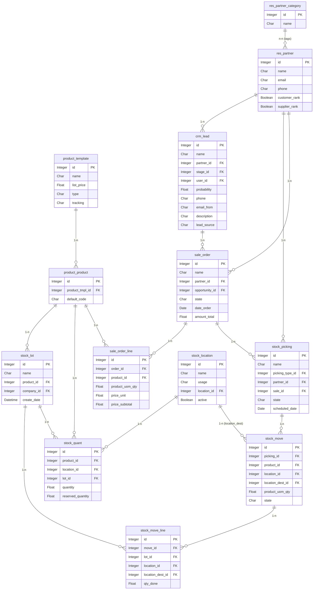
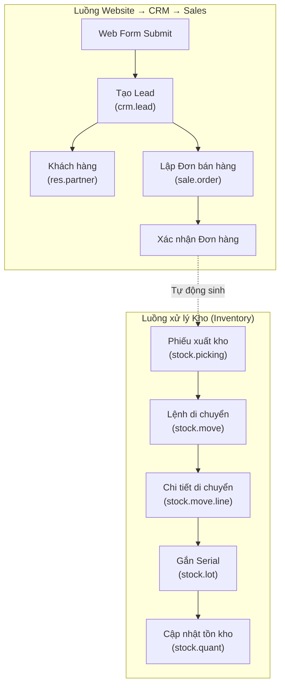

# Tài liệu Thiết kế Dữ liệu (ERD)

**Dự án:** VoPC-CMCTS Phase 1  
**Phiên bản:** 1.0  
**Ngày lập:** 09/06/2026

---

## 1. Sơ đồ thực thể kết hợp (Entity-Relationship Diagram)

Sơ đồ ERD thể hiện mối liên kết giữa các bảng chính trong các phân hệ Inventory, CRM và Sales.



---

## 2. Chi tiết các bảng dữ liệu

### 2.1 Bảng `product.template` (Template sản phẩm)

**Mô tả:** Chứa thông tin chung của sản phẩm (ví dụ: mẫu Laptop Dell). Đây là bảng cha, mỗi template có thể có nhiều biến thể (variant).

| Field       | Kiểu      | Mô tả                                                                 |
| ----------- | --------- | --------------------------------------------------------------------- |
| id          | Integer   | Khóa chính                                                            |
| name        | Char      | Tên sản phẩm (VD: Laptop Dell Inspiron 15)                            |
| list_price  | Float     | Giá bán mặc định                                                      |
| type        | Selection | Loại sản phẩm: `consu` (tiêu hao) / `storable` (lưu kho) / `service`  |
| tracking    | Selection | Phương thức theo dõi: `none` / `lot` / **`serial`** ← quan trọng nhất |
| categ_id    | Many2one  | Danh mục sản phẩm                                                     |
| description | Text      | Mô tả chi tiết                                                        |

> ⚠️ **Lưu ý:** Field `tracking = 'serial'` là điều kiện bắt buộc để hệ thống yêu cầu nhập Serial Number khi làm phiếu kho.

---

### 2.2 Bảng `product.product` (Sản phẩm / Variant)

**Mô tả:** Biến thể cụ thể của sản phẩm (VD: Laptop Dell màu Đen, RAM 8GB). Trong dự án này hầu hết sản phẩm chỉ có 1 variant.

| Field           | Kiểu     | Mô tả                           |
| --------------- | -------- | ------------------------------- |
| id              | Integer  | Khóa chính                      |
| product_tmpl_id | Many2one | Liên kết đến `product.template` |
| default_code    | Char     | Mã sản phẩm nội bộ (SKU)        |
| active          | Boolean  | Còn kinh doanh hay đã ngừng     |

---

### 2.3 Bảng `stock.lot` (Serial Number)

**Mô tả:** Lưu thông tin từng Serial Number của sản phẩm. Đây là bảng **trung tâm** của toàn bộ tính năng tracking.

| Field       | Kiểu     | Mô tả                                     |
| ----------- | -------- | ----------------------------------------- |
| id          | Integer  | Khóa chính                                |
| name        | Char     | Mã Serial Number (VD: DELL-INS15-SN001)   |
| product_id  | Many2one | Liên kết đến sản phẩm (`product.product`) |
| company_id  | Many2one | Công ty sở hữu Serial này                 |
| create_date | Datetime | Ngày tạo Serial trong hệ thống            |
| note        | Text     | Ghi chú thêm (tình trạng, bảo hành...)    |

> 💡 **Constraint:** `name + product_id` phải là duy nhất — không được phép trùng trong cùng 1 sản phẩm.

---

### 2.4 Bảng `stock.quant` (Tồn kho thực tế)

**Mô tả:** Ghi nhận số lượng tồn kho của một sản phẩm/serial tại một vị trí cụ thể. Đây là nguồn dữ liệu cho báo cáo tồn kho thời gian thực.

| Field             | Kiểu     | Mô tả                               |
| ----------------- | -------- | ----------------------------------- |
| id                | Integer  | Khóa chính                          |
| product_id        | Many2one | Sản phẩm                            |
| location_id       | Many2one | Vị trí lưu kho (`stock.location`)   |
| lot_id            | Many2one | Serial Number (`stock.lot`)         |
| quantity          | Float    | Số lượng thực tế đang có (On Hand)  |
| reserved_quantity | Float    | Số lượng đã được đặt giữ (chờ xuất) |

> 💡 **Số lượng khả dụng = `quantity` - `reserved_quantity`**

---

### 2.5 Bảng `stock.picking` (Phiếu kho)

**Mô tả:** Phiếu đại diện cho 1 đợt Nhập / Xuất / Chuyển kho. Mỗi phiếu có thể chứa nhiều dòng sản phẩm.

| Field           | Kiểu      | Mô tả                                                 |
| --------------- | --------- | ----------------------------------------------------- |
| id              | Integer   | Khóa chính                                            |
| name            | Char      | Số phiếu tự sinh (VD: WH/OUT/0001, WH/IN/0001)        |
| picking_type_id | Many2one  | Loại phiếu: Nhập kho / Xuất kho / Nội bộ              |
| partner_id      | Many2one  | Khách hàng hoặc Nhà cung cấp                          |
| sale_id         | Many2one  | Liên kết đơn bán hàng nguồn (nếu có)                  |
| state           | Selection | `draft` / `waiting` / `confirmed` / `done` / `cancel` |
| scheduled_date  | Datetime  | Ngày dự kiến thực hiện                                |
| date_done       | Datetime  | Ngày thực tế hoàn thành                               |

---

### 2.6 Bảng `stock.move` (Lệnh di chuyển)

**Mô tả:** Mỗi dòng sản phẩm cần di chuyển trong phiếu kho. 1 phiếu có thể có nhiều lệnh di chuyển.

| Field            | Kiểu      | Mô tả                                    |
| ---------------- | --------- | ---------------------------------------- |
| id               | Integer   | Khóa chính                               |
| picking_id       | Many2one  | Liên kết đến phiếu kho (`stock.picking`) |
| product_id       | Many2one  | Sản phẩm cần chuyển                      |
| location_id      | Many2one  | Vị trí nguồn (xuất phát từ đâu)          |
| location_dest_id | Many2one  | Vị trí đích (đến đâu)                    |
| product_uom_qty  | Float     | Số lượng yêu cầu di chuyển               |
| state            | Selection | Trạng thái lệnh di chuyển                |

---

### 2.7 Bảng `stock.move.line` (Chi tiết di chuyển)

**Mô tả:** Di chuyển chi tiết từng món hàng theo Serial Number. Đây là nơi gán Serial cụ thể cho từng lần nhập/xuất.

| Field            | Kiểu     | Mô tả                                 |
| ---------------- | -------- | ------------------------------------- |
| id               | Integer  | Khóa chính                            |
| move_id          | Many2one | Liên kết đến `stock.move`             |
| lot_id           | Many2one | Serial Number được chọn (`stock.lot`) |
| location_id      | Many2one | Vị trí nguồn thực tế                  |
| location_dest_id | Many2one | Vị trí đích thực tế                   |
| qty_done         | Float    | Số lượng thực tế đã hoàn thành        |

> 💡 Với sản phẩm tracking = serial: mỗi `stock.move.line` chỉ có đúng **1 Serial** và `qty_done = 1`.

---

### 2.8 Bảng `stock.location` (Vị trí kho)

**Mô tả:** Vị trí vật lý hoặc ảo trong kho. Có thể là kệ hàng, khu vực, hoặc location đặc biệt như "Khách hàng", "Nhà cung cấp".

| Field       | Kiểu      | Mô tả                                                         |
| ----------- | --------- | ------------------------------------------------------------- |
| id          | Integer   | Khóa chính                                                    |
| name        | Char      | Tên vị trí (VD: Khu nhập hàng, Kệ A1)                         |
| usage       | Selection | `internal` (kho nội bộ) / `customer` / `supplier` / `transit` |
| location_id | Many2one  | Vị trí cha (cấu trúc cây)                                     |
| active      | Boolean   | Vị trí còn hoạt động hay đã đóng                              |

---

### 2.9 Bảng `res.partner` (Đối tác)

**Mô tả:** Dùng chung cho cả Khách hàng và Nhà cung cấp. Phân biệt qua field `customer_rank` và `supplier_rank`.

| Field         | Kiểu      | Mô tả                               |
| ------------- | --------- | ----------------------------------- |
| id            | Integer   | Khóa chính                          |
| name          | Char      | Tên đối tác                         |
| email         | Char      | Email liên hệ                       |
| phone         | Char      | Số điện thoại                       |
| customer_rank | Integer   | > 0 nếu là khách hàng               |
| supplier_rank | Integer   | > 0 nếu là nhà cung cấp             |
| category_id   | Many2many | Tags phân loại (VIP, Thân thiết...) |
| street        | Char      | Địa chỉ                             |

---

### 2.10 Bảng `res.partner.category` (Tag khách hàng)

**Mô tả:** Nhãn (tag) để phân loại khách hàng trong CRM.

| Field  | Kiểu    | Mô tả                                         |
| ------ | ------- | --------------------------------------------- |
| id     | Integer | Khóa chính                                    |
| name   | Char    | Tên tag (VD: VIP, Thân thiết, Tiềm năng, Mới) |
| color  | Integer | Màu hiển thị trên giao diện                   |
| active | Boolean | Tag còn sử dụng hay không                     |

---

### 2.11 Bảng `crm.lead` (Cơ hội kinh doanh)

**Mô tả:** Lead hoặc Opportunity trong pipeline CRM. Được tạo tự động từ form website hoặc nhân viên tạo thủ công.

| Field       | Kiểu     | Mô tả                                                |
| ----------- | -------- | ---------------------------------------------------- |
| id          | Integer  | Khóa chính                                           |
| name        | Char     | Tên cơ hội (VD: Tư vấn hệ thống kho cho Công ty ABC) |
| partner_id  | Many2one | Khách hàng (`res.partner`)                           |
| stage_id    | Many2one | Bước hiện tại trong pipeline                         |
| user_id     | Many2one | Nhân viên Sales phụ trách                            |
| probability | Float    | Xác suất chốt hợp đồng (0-100%)                      |
| email_from  | Char     | Email khách hàng                                     |
| phone       | Char     | Số điện thoại khách hàng                             |
| description | Text     | Nội dung tư vấn, nhu cầu của khách                   |
| lead_source | Selection| Nguồn gốc Lead (website_form / manual / phone)       |
| create_date | Datetime | Ngày tạo Lead                                        |

---

### 2.12 Bảng `sale.order` (Đơn bán hàng)

**Mô tả:** Đơn bán hàng được chốt từ cơ hội kinh doanh. Khi xác nhận tự động sinh phiếu xuất kho.

| Field          | Kiểu      | Mô tả                                              |
| -------------- | --------- | -------------------------------------------------- |
| id             | Integer   | Khóa chính                                         |
| name           | Char      | Mã đơn hàng tự sinh (VD: S00001)                   |
| partner_id     | Many2one  | Khách hàng (`res.partner`)                         |
| opportunity_id | Many2one  | Liên kết về CRM Lead (`crm.lead`)                  |
| state          | Selection | `draft` / `sale` (đã xác nhận) / `done` / `cancel` |
| date_order     | Datetime  | Ngày tạo đơn                                       |
| amount_total   | Float     | Tổng giá trị đơn hàng                              |

---

### 2.13 Bảng `sale.order.line` (Chi tiết đơn hàng)

**Mô tả:** Chi tiết từng sản phẩm được bán trong đơn hàng.

| Field           | Kiểu     | Mô tả                                  |
| --------------- | -------- | -------------------------------------- |
| id              | Integer  | Khóa chính                             |
| order_id        | Many2one | Liên kết đến đơn hàng (`sale.order`)   |
| product_id      | Many2one | Sản phẩm được bán (`product.product`)  |
| product_uom_qty | Float    | Số lượng đặt mua                       |
| price_unit      | Float    | Đơn giá                                |
| price_subtotal  | Float    | Thành tiền (tự tính: qty × price_unit) |

---

## 3. Sơ đồ luồng dữ liệu (Data Flow)



---

## 4. Luồng vòng đời Serial Number

Đây là luồng **trọng tâm** của đề tài — theo dõi một Serial từ khi nhập đến khi xuất.

```
[Nhập kho]
product.template (tracking=serial)
    └── product.product
            └── stock.lot (name="SN-001")  ← Serial được tạo
                    └── stock.quant (location=Khu nhập, qty=1)

[Chuyển kho nội bộ]
stock.picking (type=Internal)
    └── stock.move (src=Khu nhập → dest=Khu lưu trữ)
            └── stock.move.line (lot_id=SN-001, qty_done=1)
                    └── stock.quant cập nhật: Khu nhập qty=0, Khu lưu trữ qty=1

[Xuất kho]
sale.order → stock.picking (type=Delivery)
    └── stock.move (src=Khu lưu trữ → dest=Customers)
            └── stock.move.line (lot_id=SN-001, qty_done=1)
                    └── stock.quant cập nhật: Khu lưu trữ qty=0

[Tra cứu Traceability]
stock.lot (name="SN-001")
    → Hiển thị toàn bộ stock.move.line liên quan
    → Phiếu nhập WH/IN/0001 (09/06/2026)
    → Phiếu chuyển WH/INT/0001 (10/06/2026)
    → Phiếu xuất WH/OUT/0001 → Khách hàng ABC (15/06/2026)
```

---

## 5. Phân quyền truy cập theo bảng

| Bảng                   | Admin      | NV Kho     | NV Sales   | Khách hàng |
| ---------------------- | ---------- | ---------- | ---------- | ---------- |
| `product.template`     | ✅ Đọc/Ghi | ✅ Đọc/Ghi | ✅ Đọc     | ❌         |
| `stock.lot`            | ✅ Đọc/Ghi | ✅ Đọc/Ghi | ❌         | ❌         |
| `stock.quant`          | ✅ Đọc/Ghi | ✅ Đọc/Ghi | ❌         | ❌         |
| `stock.picking`        | ✅ Đọc/Ghi | ✅ Đọc/Ghi | ✅ Đọc     | ❌         |
| `crm.lead`             | ✅ Đọc/Ghi | ❌         | ✅ Đọc/Ghi | ❌         |
| `sale.order`           | ✅ Đọc/Ghi | ✅ Đọc     | ✅ Đọc/Ghi | ❌         |
| `res.partner`          | ✅ Đọc/Ghi | ✅ Đọc     | ✅ Đọc/Ghi | ❌         |
| `res.partner.category` | ✅ Đọc/Ghi | ❌         | ✅ Đọc/Ghi | ❌         |

---

_Tài liệu này được lưu tại: `/docs/ERD_VoPC_cmcts.md` trên GitHub repo_  
_Cập nhật lần cuối: 09/06/2026_
