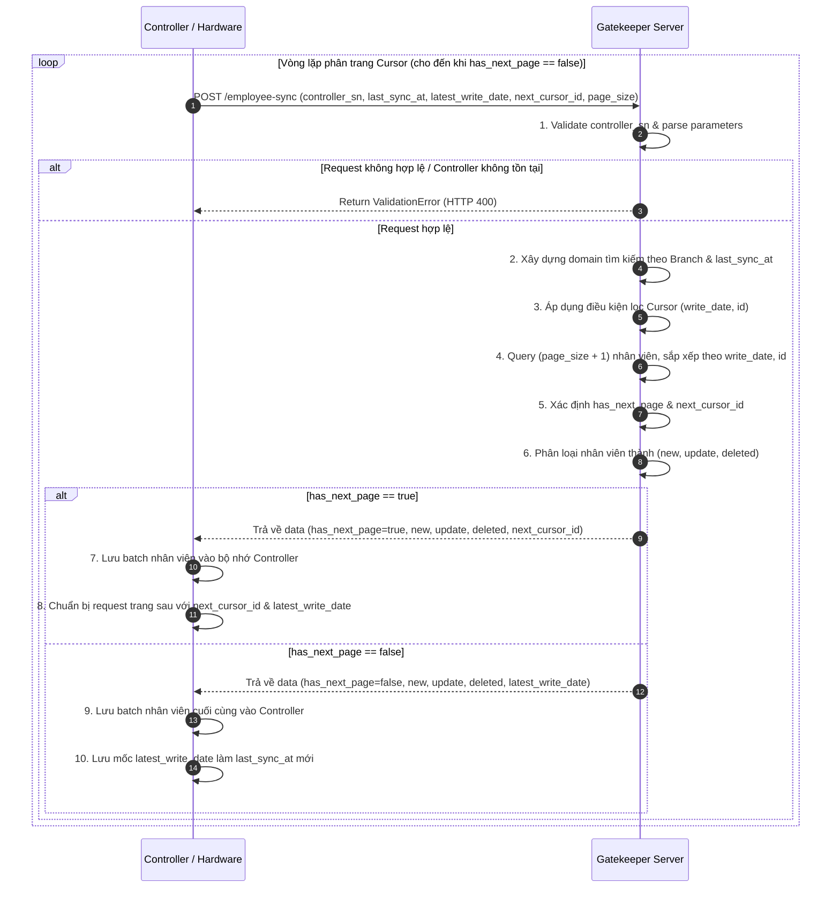
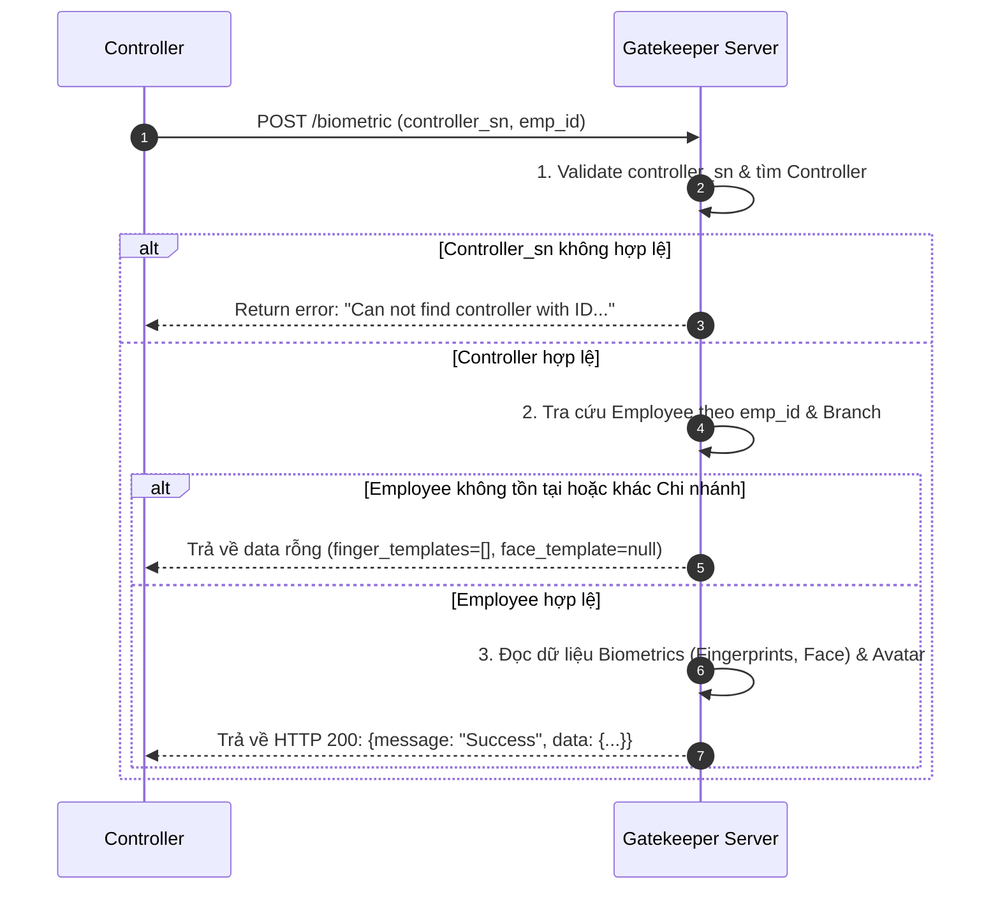
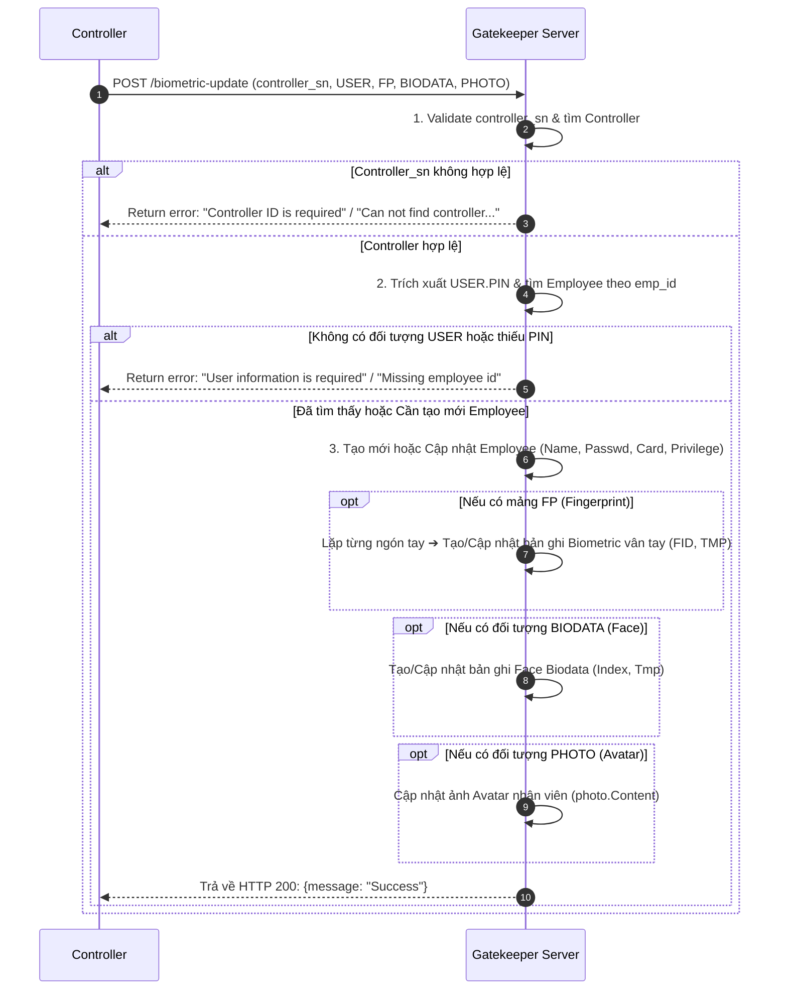

# 📘 Tài Liệu Kỹ Thuật Tích Hợp API Nhân Sự & Sinh Trắc Học (Employee & Biometric APIs)

> **Hệ thống**: T4 Gate Keeper (Odoo 19 Module)  
> **Phiên bản tài liệu**: 1.4 (Trích xuất đoạn mã nguồn Python gốc từ gk_controller.py)  
> **Đối tượng áp dụng**: Lập trình viên Firmware Controller, Team Tích hợp phần cứng Access Control, Lập trình viên Backend.

---

## 📌 MỤC LỤC

1. [TỔNG QUAN & QUY TẮC BẮT BUỘC](#1-tổng-quan--quy-tắc-bắt-buộc)
   * [1.1. Mã Nhân Viên Bất Biến (emp_id)](#11-mã-nhân-viên-bất-biến-emp_id)
   * [1.2. Phân Quyền Chi Nhánh (Branch Scope)](#12-phân-quyền-chi-nhánh-branch-scope)
2. [API 1: ControllerEmployeeSync (ĐẶC TẢ CHI TIẾT THUẬT TOÁN PHÂN TRANG CỦA DEV)](#2-api-1-controlleremployeesync)
   * [2.1. Nguyên lý thuật toán phân trang con trỏ (Cursor-Based Pagination Spec)](#21-nguyên-lý-thuật-toán-phân-trang-con-trỏ-cursor-based-pagination-spec)
   * [2.2. Cơ chế lọc & đảm bảo duyệt tiếp dữ liệu (Tuple Comparison Logic & Code Gốc)](#22-cơ-chế-lọc--đảm-bảo-duyệt-tiếp-dữ-liệu-tuple-comparison-logic--code-gốc)
   * [2.3. Cơ chế nhận biết trang kế tiếp (Kỹ thuật Limit N+1 & Code Gốc)](#23-cơ-chế-nhận-biết-trang-kế-tiếp-kỹ-thuật-limit-n1--code-gốc)
   * [2.4. Quy tắc phân loại dữ liệu thực thi phía Controller (new, update, deleted & Code Gốc)](#24-quy-tắc-phân-loại-dữ-liệu-thực-thi-phía-controller-new-update-deleted--code-gốc)
   * [2.5. Bảng tham số Request & Response](#25-bảng-tham-số-request--response)
   * [2.6. Mã giả thuật toán lặp dành cho Controller Firmware](#26-mã-giả-thuật-toán-lặp-dành-cho-controller-firmware)
   * [2.7. Ví dụ luồng gọi phân trang thực tế](#27-ví-dụ-luồng-gọi-phân-trang-thực-tế)
   * [2.8. Sơ đồ tuần tự (Sequence Diagram)](#28-sơ-đồ-tuần-tự-sequence-diagram)
   * [2.9. Các lưu ý kỹ thuật quan trọng](#29-các-lưu-ý-kỹ-thuật-quan-trọng)
3. [API 2: EmployeeBiometricGet (LẤY MẪU SINH TRẮC HỌC CỦA NHÂN VIÊN)](#3-api-2-employeebiometricget)
   * [3.1. Mục đích & Quy tắc truy vấn](#31-mục-đích--quy-tắc-truy-vấn)
   * [3.2. Cấu trúc Request & Response](#32-cấu-trúc-request--response)
   * [3.3. Sơ đồ tuần tự (Sequence Diagram)](#33-sơ-đồ-tuần-tự-sequence-diagram)
4. [API 3: EmployeeBiometricUpdate (ĐẨY DỮ LIỆU SINH TRẮC HỌC TỪ CONTROLLER LÊN SERVER)](#4-api-3-employeebiometricupdate)
   * [4.1. Mục đích & Luồng xử lý](#41-mục-đích--luồng-xử-lý)
   * [4.2. Cấu trúc Request Payload chi tiết (USER, FP, BIODATA, PHOTO)](#42-cấu-trúc-request-payload-chi-tiết)
   * [4.3. Sơ đồ tuần tự (Sequence Diagram)](#43-sơ-đồ-tuần-tự-sequence-diagram)
5. [TỔNG HỢP MÃ LỖI & HTTP STATUS CODES](#5-tổng-hợp-mã-lỗi--http-status-codes)

---

## 1. TỔNG QUAN & QUY TẮC BẮT BUỘC

### 1.1. Mã Nhân Viên Bất Biến (`emp_id`)
* **Mã định danh `emp_id`**: Số nguyên duy nhất, tự động sinh tăng dần. Tách biệt hoàn toàn với mã Odoo HR (`hr.employee`).
* **Không được thay đổi (`Immutable`)**: Dữ liệu sinh trắc học trên thiết bị vật lý được ghi đè cố định theo `emp_id`. Nếu đổi mã trên Server sẽ làm gãy liên kết phần cứng.
* **Đồng bộ tên HR**: Khi Odoo HR đổi tên nhân viên, Gate Keeper tự động cập nhật tên mới nhưng **giữ nguyên `emp_id`**.

### 1.2. Phân Quyền Chi Nhánh (Branch Scope)
* Controller thuộc Chi nhánh nào **chỉ được phép đồng bộ/truy vấn** nhân viên thuộc Chi nhánh đó (`branch_id = controller.branch_id`) hoặc nhân viên dùng chung toàn hệ thống (`branch_id = False`).
* Truy vấn chéo Chi nhánh sẽ bị hệ thống từ chối (`ValidationError`).

---

## 2. API 1: ControllerEmployeeSync

### 2.1. Nguyên lý thuật toán phân trang con trỏ (Cursor-Based Pagination Spec)
Để đảm bảo khả năng chịu tải trên thiết bị phần cứng và tính toàn vẹn dữ liệu thời gian thực, hệ thống **không áp dụng phân trang chỉ số (`offset/page`)**. Lý do: nếu dữ liệu biến động (thêm/sửa/xóa) trong lúc Controller đang gọi API, phân trang `offset` sẽ gây ra hiện tượng bỏ sót hoặc đọc lặp bản ghi.

Hệ thống sử dụng **Thuật toán con trỏ kép (Double Cursor Pointer)** dựa trên cặp tiêu chí sắp xếp cố định: `(write_date ASC, id ASC)`.
1. `latest_write_date`: Mốc thời gian sửa đổi gần nhất của bản ghi cuối trang hiện tại.
2. `next_cursor_id`: ID định danh duy nhất của bản ghi cuối trang hiện tại.

---

### 2.2. Cơ chế lọc & đảm bảo duyệt tiếp dữ liệu (Tuple Comparison Logic & Code Gốc)
Khi Controller truyền lại `latest_write_date` (`cursor_write_date`) và `next_cursor_id` (`cursor_id`) từ trang trước, Server thực thi truy vấn lọc theo logic so sánh tuple chuẩn:

$$\text{Filter} = (\text{write\_date} > \text{cursor\_write\_date}) \lor (\text{write\_date} == \text{cursor\_write\_date} \land \text{id} > \text{cursor\_id})$$

#### 💻 Đoạn mã nguồn Python gốc trong Server (`gk_controller.py:L257-L264`):
```python
if cursor_id and cursor_write_date:
    domain += [
        "|",
            ("write_date", ">", cursor_write_date),
        "&",
            ("write_date", "=", cursor_write_date),
            ("id", ">", cursor_id)
    ]
```

#### 💡 Ý nghĩa vận hành cho Controller:
* **Trường hợp thời gian khác nhau**: Server duyệt tiếp các bản ghi được cập nhật sau mốc `cursor_write_date`.
* **Trường hợp thời gian trùng nhau (Cùng 1 giây)**: Khi có nhiều bản ghi được sửa đổi trong cùng 1 giây (`write_date` bằng nhau), Server tự động dựa vào `cursor_id` để đọc tiếp các bản ghi có ID lớn hơn, triệt tiêu hoàn toàn nguy cơ lặp lại dữ liệu.

---

### 2.3. Cơ chế nhận biết trang kế tiếp (Kỹ thuật Limit N+1 & Code Gốc)
Server áp dụng kỹ thuật truy vấn vượt ngưỡng `Limit = Page Size + 1` để kiểm tra trạng thái trang tiếp theo:

#### 💻 Đoạn mã nguồn Python gốc trong Server (`gk_controller.py:L266-L280`):
```python
# Query vượt quá 1 bản ghi so với page_size yêu cầu
employee = self._get_employees_to_sync(domain, limit=page_size + 1)
if employee:
    latest_write_date = max(employee.mapped("write_date"))
else:
    latest_write_date = fields.Datetime.now()

# Phát hiện còn trang kế tiếp nếu tổng bản ghi query được lớn hơn page_size
has_next_page = len(employee) > page_size

if has_next_page:
    # Cắt bỏ bản ghi thứ N+1 thừa, chỉ giữ lại đúng số lượng page_size
    employee = employee[:page_size]

next_cursor = None
if has_next_page and employee:
    # Lấy ID của phần tử cuối cùng trong trang làm next_cursor_id
    last = employee[-1]
    next_cursor = last.id
```

#### 💡 Quy tắc hoạt động:
* **Nếu Số bản ghi nhận được > `page_size`**: Đã phát hiện còn dữ liệu ở trang sau ➔ Server gán `has_next_page = true`, cắt đúng `page_size` bản ghi đầu trả về và gán `next_cursor_id` = ID của bản ghi thứ `page_size`.
* **Nếu Số bản ghi nhận được $\le$ `page_size`**: Đã đến trang cuối cùng ➔ Server gán `has_next_page = false` và `next_cursor_id = null`.

---

### 2.4. Quy tắc phân loại dữ liệu thực thi phía Controller (new, update, deleted & Code Gốc)

#### 💻 Đoạn mã nguồn Python gốc trong Server (`gk_controller.py:L282-L293`):
```python
new = []
update = []
deleted = []

for emp in employee:
    if not emp.active:
        # 1. Nhân viên ngưng hoạt động -> Đưa vào mảng deleted
        deleted.append(emp)
    elif not last_sync:
        # 2. Lần đầu đồng bộ -> Đưa vào mảng new
        new.append(emp)
    elif emp.create_date > last_sync:
        # 3. Nhân viên mới tạo sau mốc sync -> Đưa vào mảng new
        new.append(emp)
    else:
        # 4. Nhân viên cũ cập nhật thông tin -> Đưa vào mảng update
        update.append(emp)
```

#### 📋 Bảng ma trận lệnh thực thi bắt buộc cho Controller Firmware:

| Mảng trả về | Điều kiện logic phía Server | Lệnh thực thi bắt buộc trên Controller Firmware |
| :--- | :--- | :--- |
| `deleted` | Nhân viên bị ngưng hoạt động (`active = False`). | **XOÁ / THU HỒI QUYỀN**: Xóa nhân viên và thu hồi các quyền truy cập/thẻ từ/sinh trắc học tương ứng khỏi RAM/Flash. |
| `new` | Lần đầu sync (`last_sync_at` rỗng) HOẶC Nhân viên tạo mới (`create_date > last_sync_at`). | **THÊM MỚI**: Khởi tạo bản ghi người dùng mới và nạp danh sách template sinh trắc học vào bộ nhớ thiết bị. |
| `update` | Nhân viên cũ được cập nhật thông tin (`create_date <= last_sync_at` & `write_date > last_sync_at`). | **GHI ĐÈ / CẬP NHẬT**: Cập nhật lại thông tin cá nhân, thẻ từ, mật khẩu hoặc cập nhật lại các mẫu sinh trắc học mới. |

---

### 2.5. Bảng tham số Request & Response

#### 📥 Request Payload (HTTP POST)

| Tham số | Kiểu dữ liệu | Bắt buộc | Mô tả |
| :--- | :--- | :---: | :--- |
| `controller_sn` | String | **Có** | Mã Serial Number của Controller. |
| `last_sync_at` | Datetime | Không | Mốc thời gian sync thành công đợt trước (`YYYY-MM-DD HH:MM:SS`). Để trống nếu đồng bộ từ đầu. |
| `page_size` | Integer | Không | Số bản ghi/trang (Mặc định: `15`, tối thiểu: `1`). |
| `latest_write_date` | Datetime | Không | **Truyền từ Trang 2 trở đi**: Nhận giá trị `latest_write_date` từ Response trang trước. |
| `next_cursor_id` | Integer | Không | **Truyền từ Trang 2 trở đi**: Nhận giá trị `next_cursor_id` từ Response trang trước. |

#### 📤 Response Payload (HTTP 200 OK)

```json
{
  "message": "Employee sync completed",
  "data": {
    "data": {
      "next_cursor_id": 30,
      "has_next_page": true,
      "latest_write_date": "2026-08-04 10:15:00",
      "new": [
        {
          "id": 1001,
          "name": "Nguyễn Văn A",
          "branch_id": 1,
          "biometrics": [
            {
              "type": "fingerprint",
              "template": "mẫu_vân_tay_base64...",
              "finger_index/slot": 1
            }
          ]
        }
      ],
      "update": [],
      "deleted": []
    }
  }
}
```

---

### 2.6. Mã giả thuật toán lặp dành cho Controller Firmware

```python
# 1. Đọc mốc thời gian đồng bộ thành công của đợt trước từ Flash
last_sync_time = load_from_flash("last_sync_at") # VD: "2026-08-01 00:00:00"

# 2. Khởi tạo biến con trỏ
next_cursor_id = None
latest_write_date = None
has_next_page = True

# 3. Vòng lặp phân trang
while has_next_page:
    payload = {
        "controller_sn": "CTRL-OFFICE-001",
        "last_sync_at": last_sync_time,
        "page_size": 15
    }
    
    # Nếu từ Trang 2 trở đi, truyền Cursor từ trang liền trước vào Request
    if next_cursor_id and latest_write_date:
        payload["next_cursor_id"] = next_cursor_id
        payload["latest_write_date"] = latest_write_date

    # Call API Server
    response = call_api("POST", "/employee-sync", payload)
    res_data = response["data"]["data"]

    # Nạp dữ liệu batch hiện tại vào thiết bị phần cứng
    process_new_employees(res_data["new"])
    process_updated_employees(res_data["update"])
    process_deleted_employees(res_data["deleted"])

    # Cập nhật con trỏ cho vòng lặp kế tiếp
    has_next_page = res_data["has_next_page"]
    next_cursor_id = res_data["next_cursor_id"]
    latest_write_date = res_data["latest_write_date"]

# 4. Khi kết thúc toàn bộ các trang (has_next_page == False):
# Lưu giá trị latest_write_date của trang cuối cùng làm last_sync_at mới
save_to_flash("last_sync_at", latest_write_date)
```

---

### 2.7. Ví dụ luồng gọi phân trang thực tế

#### 🟢 Trang 1 (Gửi mốc sync cũ, không có Cursor):
* **Request Payload**:
  ```json
  {
    "controller_sn": "CTRL-OFFICE-001",
    "last_sync_at": "2026-08-01 00:00:00",
    "page_size": 15
  }
  ```
* **Response Payload**:
  ```json
  {
    "message": "Employee sync completed",
    "data": {
      "data": {
        "has_next_page": true,
        "next_cursor_id": 15,
        "latest_write_date": "2026-08-04 10:15:00",
        "new": [ ...15 nhân viên đầu tiên... ],
        "update": [],
        "deleted": []
      }
    }
  }
  ```

---

#### 🟢 Trang 2 (Truyền `next_cursor_id=15` và `latest_write_date="2026-08-04 10:15:00"` từ Trang 1):
* **Request Payload**:
  ```json
  {
    "controller_sn": "CTRL-OFFICE-001",
    "last_sync_at": "2026-08-01 00:00:00",
    "page_size": 15,
    "next_cursor_id": 15,
    "latest_write_date": "2026-08-04 10:15:00"
  }
  ```
* **Response Payload**:
  ```json
  {
    "message": "Employee sync completed",
    "data": {
      "data": {
        "has_next_page": false,
        "next_cursor_id": null,
        "latest_write_date": "2026-08-04 11:30:00",
        "new": [ ...5 nhân viên còn lại... ],
        "update": [],
        "deleted": []
      }
    }
  }
  ```
  👉 **Hoàn tất**: `has_next_page` = `false`. Controller lưu mốc `"2026-08-04 11:30:00"` làm `last_sync_at` mới cho lần sau.

---

### 2.8. Sơ đồ tuần tự (Sequence Diagram)



---

### 2.9. Các lưu ý kỹ thuật quan trọng
1. **Giữ nguyên `page_size`**: Không đổi `page_size` giữa các trang trong cùng 1 đợt loop.
2. **Định kiện dừng lặp**: Chỉ dừng lặp khi `has_next_page == false`. Không dựa vào độ dài danh sách mảng `new`/`update` vì mảng có thể rỗng ở trang trung gian.
3. **Cập nhật `last_sync_at`**: Chỉ cập nhật mốc `last_sync_at` mới sau khi đợt lặp phân trang đã hoàn tất hoàn toàn (`has_next_page == false`).

---

## 3. API 2: EmployeeBiometricGet

### 3.1. Mục đích & Quy tắc truy vấn
Cho phép Controller truy vấn chi tiết toàn bộ danh sách template sinh trắc học (vân tay, khuôn mặt) và ảnh chân dung (avatar) của một nhân viên cụ thể theo `emp_id`.

* **Endpoint Name**: `EmployeeBiometricGet`
* **HTTP Method**: `POST`
* **Quy tắc phân quyền**: Controller chỉ được lấy sinh trắc học của nhân viên thuộc cùng Chi nhánh hoặc nhân viên tự do (`branch_id = False`).

---

### 3.2. Cấu trúc Request & Response

#### 📥 Request Payload (HTTP POST)

```json
{
  "controller_sn": "CTRL-OFFICE-001",
  "emp_id": 1001
}
```

#### 📤 Response Payload (HTTP 200 OK)

```json
{
  "message": "Success",
  "data": {
    "emp_id": 1001,
    "finger_templates": [
      "mẫu_vân_tay_ngón_1_base64...",
      "mẫu_vân_tay_ngón_2_base64..."
    ],
    "face_template": "mẫu_khuôn_mặt_base64...",
    "photo_avatar": "chuỗi_ảnh_chân_dung_base64..."
  }
}
```

---

### 3.3. Sơ đồ tuần tự (Sequence Diagram)



---

## 4. API 3: EmployeeBiometricUpdate

### 4.1. Mục đích & Luồng xử lý
Cho phép Controller đẩy dữ liệu người dùng mới tạo/chỉnh sửa tại thiết bị phần cứng (tên, mật khẩu quẹt cửa, thẻ RFID, cấp độ quyền), cùng các mẫu sinh trắc học (vân tay, khuôn mặt) và ảnh chụp chân dung trực tiếp lên Server.

* **Endpoint Name**: `EmployeeBiometricUpdate`
* **HTTP Method**: `POST`

---

### 4.2. Cấu trúc Request Payload chi tiết

```json
{
  "controller_sn": "CTRL-OFFICE-001",
  "USER": {
    "PIN": 1001,
    "Name": "Nguyễn Văn A",
    "Passwd": "123456",
    "Card": "CARD_888999",
    "Pri": 0
  },
  "FP": [
    {
      "FID": 1,
      "TMP": "mẫu_vân_tay_ngón_1_base64..."
    },
    {
      "FID": 2,
      "TMP": "mẫu_vân_tay_ngón_2_base64..."
    }
  ],
  "BIODATA": {
    "Index": 0,
    "Tmp": "mẫu_khuôn_mặt_base64..."
  },
  "PHOTO": {
    "Content": "chuỗi_ảnh_chân_dung_base64..."
  }
}
```

#### Bảng giải thích chi tiết các trường dữ liệu:

| Đối tượng | Trường | Kiểu dữ liệu | Bắt buộc | Mô tả |
| :--- | :--- | :--- | :---: | :--- |
| Root | `controller_sn` | String | **Có** | Mã Serial Number của Controller. |
| `USER` | `PIN` | Integer / String | **Có** | Mã định danh `emp_id` của nhân viên. |
| | `Name` | String | Không | Tên nhân viên hiển thị. |
| | `Passwd` | String | Không | Mật khẩu quẹt cửa (PIN code trên bàn phím thiết bị). |
| | `Card` | String | Không | Mã thẻ từ / thẻ RFID. |
| | `Pri` | Integer | Không | Cấp độ quyền trên thiết bị (`0`: Người dùng thường, `14`: Quản trị viên). |
| `FP` | `FID` | Integer | Không | Vị trí ngón tay (Finger Index: `0` - `9`). |
| | `TMP` | String (Base64) | Không | Mẫu sinh trắc học vân tay. |
| `BIODATA` | `Index` | Integer | Không | Vị trí/Slot lưu trữ khuôn mặt (Slot Index: `0`). |
| | `Tmp` | String (Base64) | Không | Mẫu sinh trắc học khuôn mặt. |
| `PHOTO` | `Content` | String (Base64) | Không | Chuỗi Mã hóa Base64 của hình ảnh chân dung avatar. |

#### 📤 Response Payload (HTTP 200 OK)

```json
{
  "message": "Success"
}
```

---

### 4.3. Sơ đồ tuần tự (Sequence Diagram)



---

## 5. TỔNG HỢP MÃ LỖI & HTTP STATUS CODES

| HTTP Code | Trường hợp xảy ra | Message mẫu trả về |
| :---: | :--- | :--- |
| **200 OK** | Xử lý thành công. | `{"message": "Success"}` hoặc `{"message": "Employee sync completed", ...}` |
| **400 Bad Request** | Thiếu trường bắt buộc `controller_sn`. | `{"message": "Controller ID is required."}` |
| **400 Bad Request** | Không tìm thấy Controller theo `controller_sn`. | `{"message": "Can not find controller with ID CTRL-XXX"}` |
| **400 Bad Request** | Thiếu mã `emp_id` khi lấy/cập nhật sinh trắc. | `{"message": "Employee ID is required."}` / `{"message": "Missing employee id"}` |
| **400 Bad Request** | Sai định dạng thời gian `last_sync_at` hoặc `latest_write_date`. | `{"message": "Invalid last sync time format. Expected YYYY-MM-DD HH-MM-SS"}` |
| **400 Bad Request** | `page_size` nhỏ hơn 1 hoặc sai định dạng. | `{"message": "Invalid page size"}` |
| **400 Bad Request** | Thiếu thông tin đối tượng `USER` trong payload update. | `{"message": "User information is required"}` |
| **401 Unauthorized** | Token xác thực hết hạn hoặc không hợp lệ. | `{"status": "error", "message": "Invalid client_secret..."}` |
